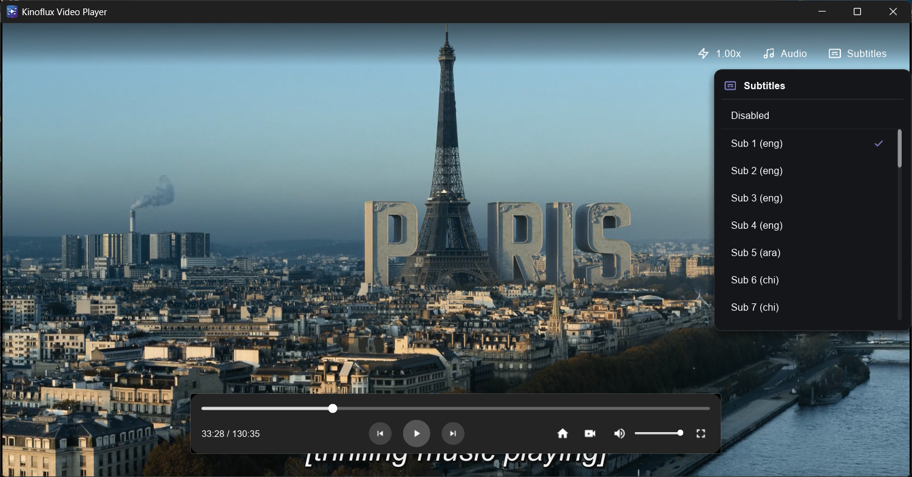
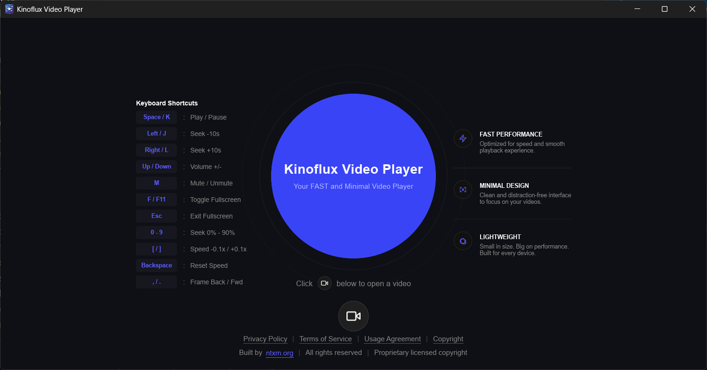

  
  <h1>kinoflux Video Player</h1>
  

    <strong>A clean, fast, and modern video player for Windows.</strong>
  

  

    <a href="#why-kinoflux">Why kinoflux</a> •
    <a href="#highlights">Highlights</a> •
    <a href="#keyboard-shortcuts">Shortcuts</a> •
    <a href="#screenshots">Screenshots</a> •
    <a href="#get-started">Get Started</a>
  

---

## Why kinoflux

kinoflux Video Player is made for people who just want to open a video and enjoy it.
No clutter, no confusion, no heavy setup.

It is built to feel smooth, simple, and premium from the first click.

## Highlights

- Clean and modern interface
- Fast startup and responsive playback
- Essential controls that stay out of your way
- Designed for everyday watching on Windows

## Keyboard Shortcuts

| Key        | Action                   |
| ---------- | ------------------------ |
| Space, K   | Play or Pause            |
| Left, J    | Seek backward 10 seconds |
| Right, L   | Seek forward 10 seconds  |
| Up or Down | Volume up or down        |
| M          | Mute or Unmute           |
| F or F11   | Toggle Fullscreen        |
| Esc        | Exit Fullscreen          |

  <h2>Screenshots</h2>
   
  
  
<em>Focused playback screen with clean controls.</em>

   
  
  
<em>Simple home screen to start watching quickly.</em>

## Get Started

1. **[Download the installer](https://github.com/ntxmproducts/kinoflux-video-player/releases/tag/KinoFlux-video-player)**
2. Open the setup file and finish installation
3. Launch kinoflux Video Player and play your video

## Privacy

Your videos stay on your device.
kinoflux does not upload your media.

---

  
Created by ntxm.org

